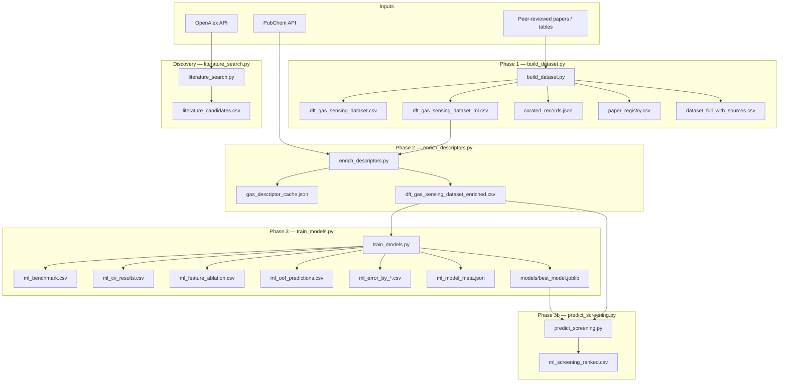

# DFT Gas-Sensing Dataset & ML Screening Pipeline (B.T.P.)

**Project report — literature-curated DFT adsorption energies for 2D gas-sensor materials, with machine-learning baselines and screening tools.**

---

## 1. Executive summary

This project builds a **machine-learning-ready dataset** of DFT-reported **gas adsorption energies (eV)** on nanomaterial sensors (graphene, TMDs, MXenes, metal oxides, etc.) and trains models to **predict binding strength on unseen materials** — a step toward screening candidates without running full VASP/CASTEP calculations on every material–gas pair.

| Milestone | Status |
|-----------|--------|
| Curated literature dataset | **480 rows · 40 papers · 81 materials · 18 gases** |
| Feature enrichment (Phase 2) | **100% material descriptor coverage** |
| ML baselines (Phase 3) | **LightGBM R² = 0.49** (material holdout) |
| Cross-validation | **5-fold material-grouped CV** |
| Screening tool | **`predict_screening.py`** + saved model |

**Best model:** LightGBM with full features (descriptors + paper-reported properties), **MAE = 0.43 eV**, **R² = 0.49** on a 20% material holdout (46 test rows, 16 unseen materials).

---

## 2. Problem statement & motivation

Gas sensors based on 2D materials (MoS₂, graphene, MXenes) are studied extensively with DFT. Each paper reports adsorption energies for a handful of material–gas pairs. Running DFT for every new combination is slow and expensive.

**Goal:** Compile published DFT numbers into one dataset, add interpretable features, and train models that generalize to **materials not seen during training** — enabling rank-order screening before committing to ab-initio work.

**Reference context:** An earlier experimental prototype exists in `reference_prior_work/` (~20 rows, experimental labels). This project uses **DFT literature values only**, not experimental data, as labels.

---

## 3. Methodology

### 3.1 Pipeline overview

```
┌─────────────────────────────────────────────────────────────────┐
│ PHASE 1 — Literature curation          scripts/build_dataset.py │
│ • Extract values from paper tables only                         │
│ • Missing → NA (never invented)                                 │
└────────────────────────────┬────────────────────────────────────┘
                             ▼
┌─────────────────────────────────────────────────────────────────┐
│ PHASE 2 — Feature enrichment      scripts/enrich_descriptors.py │
│ • Gas: PubChem (MW, XLogP, TPSA, H-bond counts)               │
│ • Material: Mat_Group, Mat_Layers, Mat_MetalFraction          │
└────────────────────────────┬────────────────────────────────────┘
                             ▼
┌─────────────────────────────────────────────────────────────────┐
│ PHASE 3 — ML training & evaluation        scripts/train_models.py│
│ • Target: Adsorption_Energy_eV                                  │
│ • Material-grouped holdout + 5-fold CV                          │
│ • Error analysis by gas, material family, DFT functional        │
└────────────────────────────┬────────────────────────────────────┘
                             ▼
┌─────────────────────────────────────────────────────────────────┐
│ PHASE 3b — Screening                      scripts/predict_screening.py│
│ • Load saved LightGBM pipeline                                  │
│ • Rank material–gas pairs by predicted binding                  │
└─────────────────────────────────────────────────────────────────┘
```

### 3.2 Data quality rules (Phase 1)

1. Only values **explicitly reported** in source papers (tables, SI, open text).
2. **No invented or estimated** numbers.
3. Missing fields recorded as **`NA`**.
4. Separate rows for different adsorption sites, dopants, phases, or functionals when reported.
5. Derived fields (`Bandgap_Change_eV`, `WorkFunction_Change_eV`) computed only when both endpoints exist in the same paper.

### 3.3 Feature engineering (Phase 2)

**Gas descriptors** (PubChem REST API, cached in `data/gas_descriptor_cache.json`):

| Feature | Description |
|---------|-------------|
| `Gas_MolecularWeight` | Molecular weight (g/mol) |
| `Gas_XLogP` | Lipophilicity proxy |
| `Gas_TPSA` | Topological polar surface area |
| `Gas_HeavyAtomCount` | Heavy atom count |
| `Gas_HBondDonorCount` / `Gas_HBondAcceptorCount` | H-bonding capacity |

**Material descriptors** (rule-based + lookup table):

| Feature | Description | Examples |
|---------|-------------|----------|
| `Mat_Group` | Material family | `carbon_2d`, `tmd`, `mxene`, `tmd_4b`, `carbon_1d` |
| `Mat_Layers` | Effective thickness | 1 = monolayer, 3 = few-layer MoS₂ |
| `Mat_MetalFraction` | Approx. metal atom fraction | 0.0 graphene, 0.33 MoS₂, 0.25 MXene |

**Paper-reported features** (used in full feature set; median-imputed when missing at train/test time):

| Feature | Coverage |
|---------|----------|
| `Charge_Transfer_e` | 57.3% of rows |
| `Adsorption_Distance_A` | 54.8% |
| `Bandgap_Before_eV` | 13.3% |
| `Bandgap_After_eV` / `Bandgap_Change_eV` | sparse |

**Categorical features:** `Gas`, `Material_Class`, `Doping`, `Functional`, `DFT_Software`, `Mat_Group`

**Design choice:** Raw `Material` name was **excluded** from training features because it prevents generalization — one-hot encoding of 81 material names cannot predict unseen materials.

### 3.4 ML evaluation protocol (Phase 3)

**Target:** `Adsorption_Energy_eV` (more negative = stronger binding)

**Split strategy — material-grouped holdout (80/20):**
- 65 materials → train (434 rows)
- 16 materials → test (46 rows), **never seen in training**
- Same random seed (42) for reproducibility

**Cross-validation:** 5-fold **material-grouped** CV (materials shuffled, split into 5 groups; each fold holds out ~16 materials). Reports mean ± std of MAE and R².

**Models tested:** Linear Regression, Random Forest, XGBoost, LightGBM, CatBoost (sklearn + gradient boosting libraries).

**Feature ablation:** Compare `descriptors_only` vs `full` (descriptors + paper-reported numerics).

---

## 4. Dataset statistics

| Metric | Value |
|--------|------:|
| Total material–gas records | 480 |
| Unique source papers (DOIs) | 40 |
| Unique materials | 81 |
| Unique gases | 18 |
| Records with numeric adsorption energy | 480 (100%) |
| Materials with ML descriptors | 81 (100%) |

**Gases:** C₂H₆, C₆H₆, CH₃CHO, CH₄, CO, CO₂, H₂, H₂O, H₂S, HF, N₂, NH₃, NO, NO₂, O₂, SO₂, SO₂F₂, SOF₂

**Top DFT functionals in dataset:** GGA-PBE (236 rows), PBE (79), PBE-GGA (30), GGA-PBE+D3 (24)

**Largest paper contributors:**

| DOI | Rows | Topic |
|-----|-----:|-------|
| 10.3390/chemengineering10030042 | 40 | Multi-B-doped graphene |
| 10.1039/C7CP08622A | 39 | O-functionalized MXenes |
| 10.1103/PhysRevB.77.125416 | 35 | Graphene (Leenaerts 2008) |
| 10.1016/j.apsusc.2019.06.049 | 32 | Defective MoSSe |
| 10.3390/nano10061215 | 24 | Zr/Hf dichalcogenides |

---

## 5. Results

### 5.1 Evolution of model performance (key iterations)

| Stage | Issue / change | Best R² (holdout) | Best MAE |
|-------|----------------|------------------:|---------:|
| Initial baseline | Sparse material descriptors, stale 398-row enrich | **−0.01** | 0.67 eV |
| Descriptor expansion | Rule-based coverage for all 81 materials | **0.35** | 0.59 eV |
| + Paper features + tree models | Charge transfer, distance, bandgap added | **0.49** | **0.43 eV |
| PubChem gas-name fixes | CO, NO, NO2 ambiguous lookups corrected | **0.49** | **0.43 eV |

### 5.2 Final holdout benchmark (`data/ml_benchmark.csv`)

Full feature set, 20% material holdout:

| Model | MAE (eV) | R² |
|-------|--------:|---:|
| **LightGBM** | **0.434** | **0.487** |
| CatBoost | 0.529 | 0.250 |
| XGBoost | 0.576 | 0.131 |
| Random Forest | 0.584 | 0.071 |
| Linear Regression | 0.904 | −0.968 |

**Held-out test materials (16):** 1H-HfS2, 1H-ZrSe2, Au-MoTe2, B-pattern Graphene (a1/c1/d1/f1), Co-anchored Graphene, Cu-MoTe2, Defective Graphene, Fe-doped Graphene, Ga-doped Graphene, Mo2CO2, N-Ga co-doped Graphene, Ni-doped Graphene, Ni-embedded Graphene, Zigzag Graphene Nanoribbon

### 5.3 Five-fold material-grouped CV (`data/ml_cv_results.csv`)

| Model | MAE mean ± std (eV) | R² mean ± std |
|-------|---------------------|---------------|
| LightGBM | 0.508 ± 0.253 | 0.110 ± 0.292 |
| CatBoost | 0.565 ± 0.301 | −0.077 ± 0.503 |
| XGBoost | 0.594 ± 0.349 | −0.342 ± 0.716 |

**Interpretation:** Single holdout R² (0.49) is optimistic relative to CV mean (0.11) because of high fold-to-fold variance with only 81 materials. Both metrics confirm the model captures real signal but is not yet production-accurate.

### 5.4 Feature ablation (`data/ml_feature_ablation.csv`)

| Feature set | Best model | R² | MAE (eV) |
|-------------|------------|---:|---------:|
| Descriptors only | Linear Regression | 0.351 | 0.589 |
| **Full (+ paper features)** | **LightGBM** | **0.487** | **0.434** |

Paper-reported charge transfer and adsorption distance materially improve tree-model performance.

---

## 6. Error analysis

### 6.1 By gas (`data/ml_error_by_gas.csv`)

Out-of-fold errors (LightGBM, pooled across CV folds):

| Gas | N rows | MAE (eV) | Notes |
|-----|-------:|---------:|-------|
| SO₂ | 41 | 0.94 | Hardest gas; wide binding range across materials |
| O₂ | 22 | 0.91 | Physically weak binding; small signal |
| NO | 71 | 0.75 | Moderate error |
| NH₃ | 82 | 0.35 | Best among common sensor targets |
| H₂ | 22 | 0.15 | Smallest errors (near-zero binding) |

### 6.2 By material family (`data/ml_error_by_mat_group.csv`)

| Mat_Group | N rows | MAE (eV) | R² |
|-----------|-------:|---------:|---:|
| mxene_defect | 30 | **2.23** | −4.87 |
| metal_oxide | 12 | 0.89 | −1.50 |
| carbon_2d | 171 | 0.53 | **0.43** |
| mxene | 44 | 0.10 | 0.33 |
| tmd_4b | 24 | 0.19 | −0.03 |

**Finding:** Sc₂CO₂ O-vacancy MXene (`mxene_defect`) dominates failure — adsorption energies span a large positive range (+1.4 eV regime) unlike most other materials. The model, trained mostly on negative binding energies, systematically under-predicts these rows.

### 6.3 By DFT functional (`data/ml_error_by_functional.csv`)

Mixed functionals (PBE, GGA-PBE, LDA, vdW-corrected) introduce **systematic energy shifts**. Rows labeled `PBE-GGA` (mostly Sc₂CO₂ O-vacancy paper) show MAE ≈ 2.23 eV. Harmonizing or normalizing per-functional offsets would likely improve R².

---

## 7. Failures, bugs, and fixes (lessons learned)

| # | Failure | Root cause | Fix applied |
|---|---------|------------|-------------|
| 1 | **Negative R²** on first ML run | 81 materials had no `Mat_Group`; enriched CSV stale (398 vs 480 rows) | Expanded rule-based descriptors; rebuilt enrich |
| 2 | **CO molecular weight = 58.9** | PubChem query `"CO"` matched cobalt metal | Map to `"carbon monoxide"` |
| 3 | **NO molecular weight = 259** | PubChem query `"NO"` matched wrong compound | Map to `"nitric oxide"` |
| 4 | **NO₂ all NA** in gas cache | Ambiguous short name | Map to `"nitrogen dioxide"` |
| 5 | **Linear Regression R² = −0.97** with full features | High collinearity + 45%+ missing paper features imputed at test | Use tree models; LR kept as diagnostic only |
| 6 | **Screening script crash** | Passed string `"NA"` to numeric imputer | Use `np.nan` for missing numerics |
| 7 | **High CV variance** (R² std ≈ 0.29) | Only 81 materials; 5 folds ≈ 16 materials each | Expected; report CV alongside single holdout |
| 8 | **Paywalled papers skipped** | No open-access tables | Documented as future data source |

---

## 8. Output files reference

### Phase 1 — Dataset

| File | Description |
|------|-------------|
| `data/dft_gas_sensing_dataset.csv` | Full curated dataset |
| `data/dft_gas_sensing_dataset_ml.csv` | ML columns only |
| `data/dataset_full_with_sources.csv` | All rows + DOI URLs + extraction notes |
| `data/curated_records.json` | JSON source records |
| `data/paper_registry.csv` | Row counts per paper |
| `data/literature_candidates.csv` | OpenAlex search candidates (421 papers) |

### Phase 2 — Enrichment

| File | Description |
|------|-------------|
| `data/dft_gas_sensing_dataset_enriched.csv` | Dataset + all ML features |
| `data/gas_descriptor_cache.json` | Cached PubChem API responses |

### Phase 3 — ML

| File | Description |
|------|-------------|
| `data/ml_benchmark.csv` | Single holdout results (all models) |
| `data/ml_cv_results.csv` | 5-fold material-grouped CV summary |
| `data/ml_feature_ablation.csv` | Descriptors-only vs full features |
| `data/ml_oof_predictions.csv` | Out-of-fold predictions (480 rows) |
| `data/ml_error_by_gas.csv` | Error breakdown by gas |
| `data/ml_error_by_mat_group.csv` | Error breakdown by material family |
| `data/ml_error_by_functional.csv` | Error breakdown by DFT functional |
| `data/ml_model_meta.json` | Saved model metadata |
| `data/models/best_model.joblib` | Fitted LightGBM pipeline |
| `data/ml_screening_ranked.csv` | Screening output (ranked predictions) |

### Visualization

| File | Description |
|------|-------------|
| `canvases/dft-dataset-catalog.canvas.tsx` | Interactive browsable catalog (480 rows) |

---

## 9. How to reproduce

### 9.1 Setup

```bash
pip install -r requirements.txt
```

Dependencies: `pandas`, `requests`, `scikit-learn`, `joblib`, `xgboost`, `lightgbm`, `catboost`

### 9.2 Full pipeline

```bash
cd scripts

# Phase 1 — build curated dataset from literature extractions
python build_dataset.py

# Phase 2 — add gas (PubChem) and material descriptors
python enrich_descriptors.py

# Phase 3 — train, evaluate, error analysis, save model
python train_models.py

# Phase 3b — rank material–gas pairs
python predict_screening.py --top 20
python predict_screening.py --material "MoS2" --gas NO2
```

### 9.3 Add new literature data

1. Add a builder function in `scripts/build_dataset.py` following the existing `record()` pattern, **or**
2. Append verified rows to `data/supplemental_records.json`
3. Re-run all three phases above

### 9.4 Refresh literature search

```bash
cd scripts
python literature_search.py
```

---

## 10. Repository layout & directory workflow

This section maps **every folder and file** in the repo, how they connect, and which commands produce which outputs.

### 10.1 Annotated directory tree

```
btp/                                    # Project root (B.T.P. gas-sensor ML pipeline)
│
├── README.md                           # Full project report (this document)
├── requirements.txt                    # Python dependencies (pandas, sklearn, boosters, joblib)
│
├── scripts/                            # All executable pipeline code
│   ├── config.py                       # TARGET_JOURNALS, TARGET_GASES, CSV_COLUMNS schema
│   ├── build_dataset.py                # Phase 1 — literature → curated CSV/JSON
│   ├── enrich_descriptors.py           # Phase 2 — PubChem gas + material descriptors
│   ├── train_models.py                 # Phase 3 — train, CV, error analysis, save model
│   ├── predict_screening.py            # Phase 3b — rank material–gas pairs
│   ├── ml_common.py                    # Shared loaders, splits, preprocessors, model registry
│   ├── literature_search.py            # OpenAlex search → literature_candidates.*
│   └── generate_canvas.py              # Optional — builds interactive catalog canvas JSON/TSX
│
├── data/                               # All generated datasets & ML artifacts (do not edit by hand)
│   │
│   │  ── Phase 1 outputs (build_dataset.py) ──
│   ├── dft_gas_sensing_dataset.csv     # Master dataset (metadata + labels + all columns)
│   ├── dft_gas_sensing_dataset_ml.csv  # ML column subset (input to Phase 2)
│   ├── curated_records.json            # Same rows as JSON (machine-readable)
│   ├── paper_registry.csv              # Row count per source DOI
│   ├── dataset_full_with_sources.csv   # Every row + DOI URL + extraction notes
│   │
│   │  ── Literature discovery (literature_search.py) ──
│   ├── literature_candidates.csv       # OpenAlex papers to extract next
│   ├── literature_candidates.json      # Same, JSON format
│   │
│   │  ── Phase 2 outputs (enrich_descriptors.py) ──
│   ├── dft_gas_sensing_dataset_enriched.csv   # ML CSV + gas/material features
│   ├── gas_descriptor_cache.json       # Cached PubChem API responses (18 gases)
│   │
│   │  ── Phase 3 outputs (train_models.py) ──
│   ├── ml_benchmark.csv                # Single 80/20 material holdout scores
│   ├── ml_cv_results.csv               # 5-fold material-grouped CV (mean ± std)
│   ├── ml_feature_ablation.csv         # descriptors_only vs full features
│   ├── ml_oof_predictions.csv          # Out-of-fold predictions (all 480 rows)
│   ├── ml_error_by_gas.csv             # MAE/R² breakdown by gas
│   ├── ml_error_by_mat_group.csv       # MAE/R² breakdown by Mat_Group
│   ├── ml_error_by_functional.csv      # MAE/R² breakdown by DFT functional
│   ├── ml_model_meta.json              # Best model name, feature list, train stats
│   │
│   │  ── Phase 3b outputs (predict_screening.py) ──
│   ├── ml_screening_ranked.csv         # Ranked predicted adsorption energies
│   │
│   │  ── Optional canvas helper ──
│   ├── canvas_payload.json             # Embedded data for IDE catalog canvas
│   │
│   └── models/
│       └── best_model.joblib           # Saved LightGBM sklearn Pipeline (for screening)
│
└── reference_prior_work/               # Earlier experimental prototype (not used as DFT labels)
    ├── README.md                       # Notes on prior ~20-row experimental dataset
    ├── gas_sensor_data.csv             # Experimental sensor data
    └── model.py                        # Prototype ML script
```

### 10.2 Data-flow diagram (which script writes what)



### 10.3 Operational workflows

#### Workflow A — Full rebuild (from scratch)

Use after adding new papers or changing `build_dataset.py`.

```bash
pip install -r requirements.txt
cd scripts
python build_dataset.py          # → data/dft_gas_sensing_dataset*.csv, curated_records.json, …
python enrich_descriptors.py     # → enriched.csv, gas_descriptor_cache.json
python train_models.py           # → ml_*.csv, models/best_model.joblib
python predict_screening.py --top 20   # → ml_screening_ranked.csv
```

#### Workflow B — Add one new paper

1. Open `scripts/build_dataset.py` → add a `def paper_name():` builder using `record()`.
2. Register it in `build_all_curated_records()` builders list.
3. Run **Workflow A** (all three phases).

Alternative: append rows to `data/supplemental_records.json` (if present) and run only `build_dataset.py` + Phase 2 + 3.

#### Workflow C — Retrain only (dataset unchanged)

```bash
cd scripts
python train_models.py
```

Reads `dft_gas_sensing_dataset_enriched.csv` → refreshes all `ml_*.csv` and `best_model.joblib`.

#### Workflow D — Screen material–gas pairs

```bash
cd scripts
python predict_screening.py                              # all known pairs, full ranking
python predict_screening.py --top 20                     # top 20 strongest binding
python predict_screening.py --material "MoS2" --gas NO2  # single prediction
```

Requires `data/models/best_model.joblib` (run `train_models.py` first).

#### Workflow E — Find new papers to extract

```bash
cd scripts
python literature_search.py    # → literature_candidates.csv (421+ OpenAlex hits)
```

Manual step: read PDFs, extract tables, then **Workflow B**.

#### Workflow F — Regenerate interactive catalog (optional)

```bash
cd scripts
python generate_canvas.py      # → ../canvases/dft-dataset-catalog.canvas.tsx (if canvas dir exists)
```

### 10.4 Script reference

| Script | Reads | Writes | When to run |
|--------|-------|--------|-------------|
| `build_dataset.py` | Builder functions in code, optional `supplemental_records.json` | `dft_gas_sensing_dataset*.csv`, `curated_records.json`, `paper_registry.csv`, `dataset_full_with_sources.csv` | After new literature extractions |
| `literature_search.py` | `config.py` journal list, OpenAlex API | `literature_candidates.csv/json` | When searching for new source papers |
| `enrich_descriptors.py` | `dft_gas_sensing_dataset_ml.csv`, PubChem API | `dft_gas_sensing_dataset_enriched.csv`, `gas_descriptor_cache.json` | After Phase 1 or when gas/material rules change |
| `train_models.py` | `dft_gas_sensing_dataset_enriched.csv` | `ml_*.csv`, `models/best_model.joblib`, `ml_model_meta.json` | After Phase 2 or when ML code changes |
| `predict_screening.py` | `best_model.joblib`, enriched schema | `ml_screening_ranked.csv` | When ranking candidate pairs |
| `generate_canvas.py` | `dataset_full_with_sources.csv`, `paper_registry.csv` | Canvas TSX + `canvas_payload.json` | Optional visualization |
| `config.py` | — | — | Edit only; defines schema and search targets |

### 10.5 `reference_prior_work/` (out of pipeline)

This folder is **not** part of the DFT pipeline. It holds an earlier **experimental** gas-sensor ML attempt (~20 rows, lab measurements). The current project uses **DFT literature values** as labels instead. Keep it for comparison only.

---

## 11. Limitations & honest assessment

1. **480 rows / 40 papers** — useful for baselines, small for deep learning or GNNs.
2. **Mixed DFT functionals** — energies are not directly comparable without per-functional calibration.
3. **Paper features missing at inference** — screening uses median-imputed charge transfer / distance (unknown for new pairs); predictions are **rank-order estimates**, not DFT replacements.
4. **R² ≈ 0.49 holdout / 0.11 CV mean** — sufficient to shortlist candidates, not to publish computed energies.
5. **Material descriptors are approximate** — no crystal structures, no atomic coordinates.
6. **PubChem dependency** — requires network on first enrich run; cached afterward.

---

## 12. Recommended future work

| Priority | Task | Expected impact |
|----------|------|-----------------|
| 1 | Per-functional energy normalization | Reduce mxene_defect / PBE-GGA errors |
| 2 | Materials Project API (bandgap, work function) | Richer material features |
| 3 | Extract paywalled papers (user-provided PDFs) | More training rows |
| 4 | Graph neural network on atomic structures | Best long-term accuracy |
| 5 | Uncertainty quantification (conformal / ensemble) | Trustworthy screening |

---

## 13. License & attribution

All numerical values are extracted from published peer-reviewed literature. **Cite the original papers** (via `DOI` column) when using this compilation in academic work. This repository is a curated compilation, not a substitute for primary DFT sources.

---

*Report generated from pipeline run on 480-row dataset. Re-run `train_models.py` after any dataset change to refresh metrics in `data/ml_*.csv`.*
