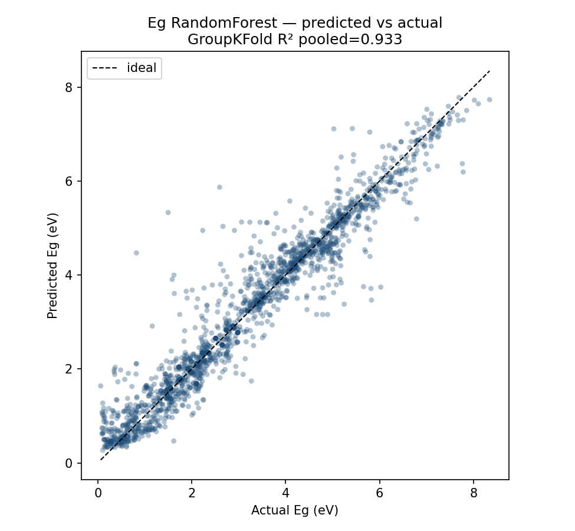
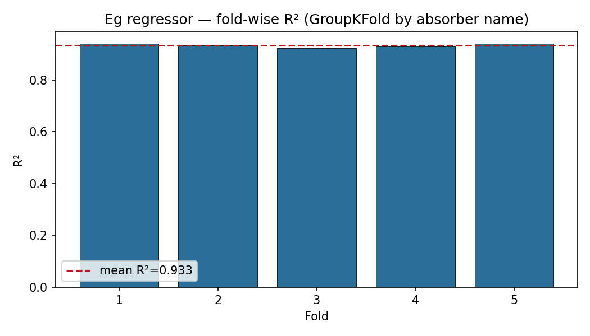
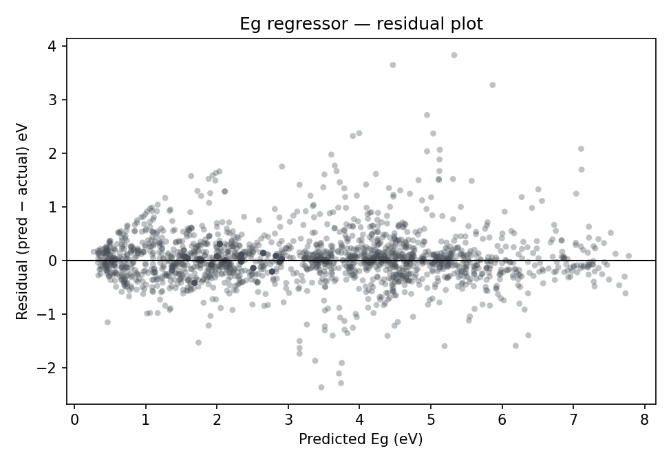
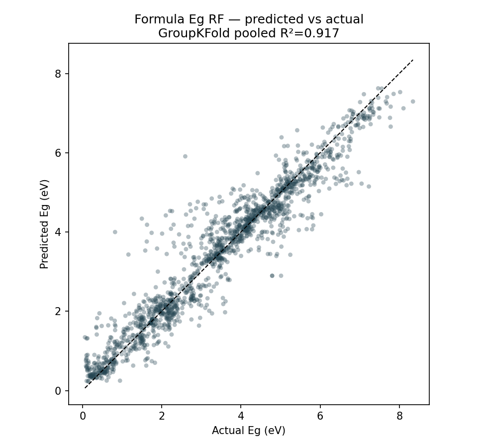
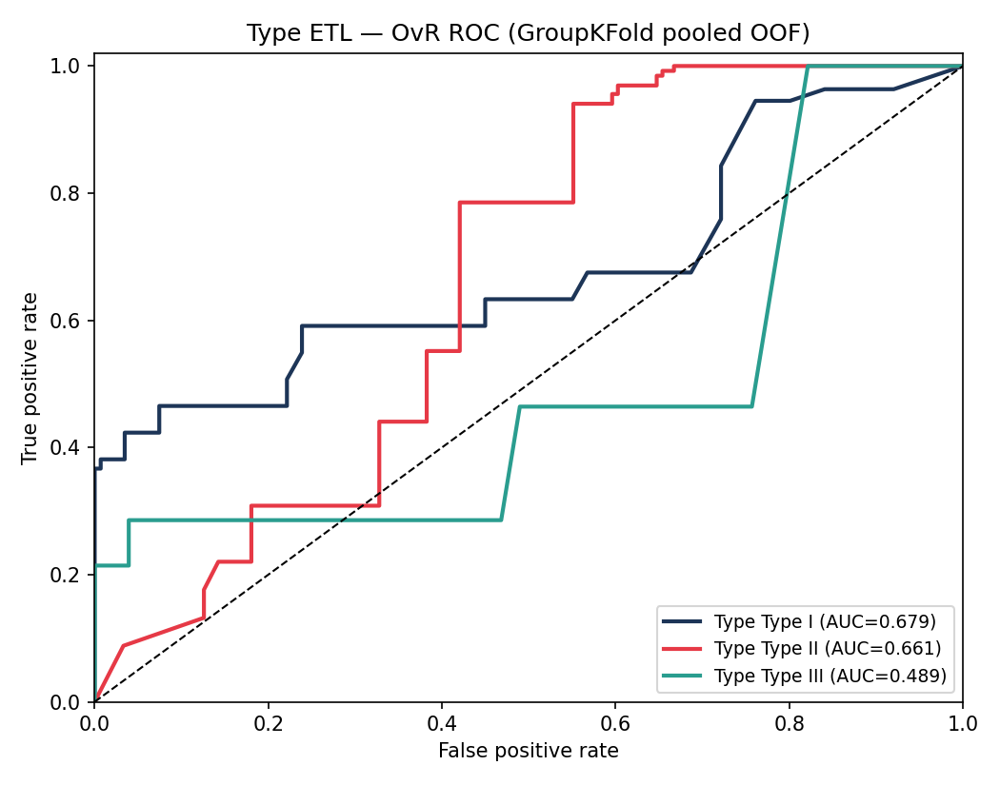
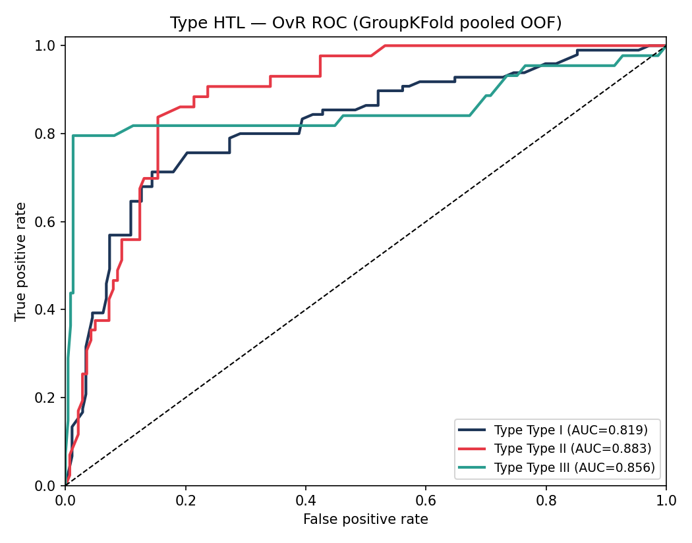
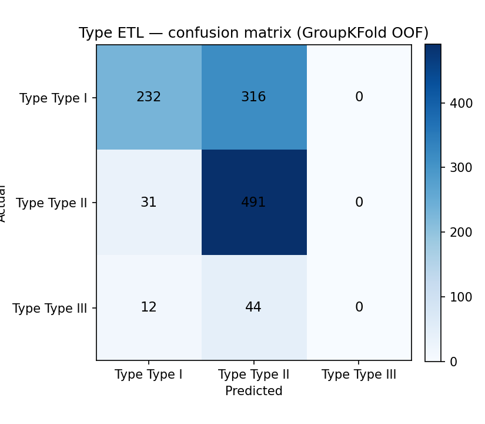
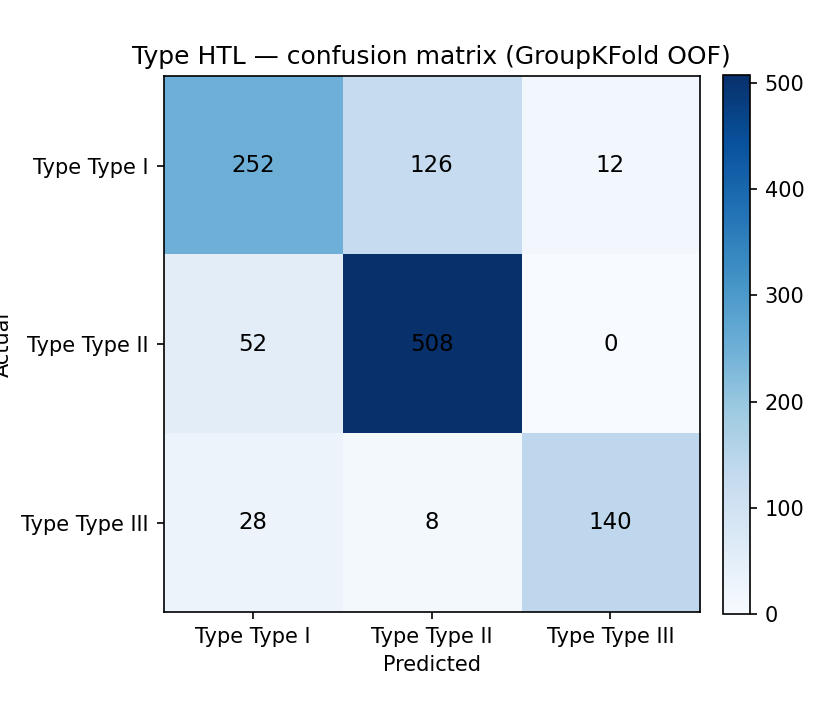
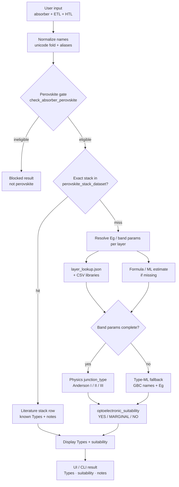
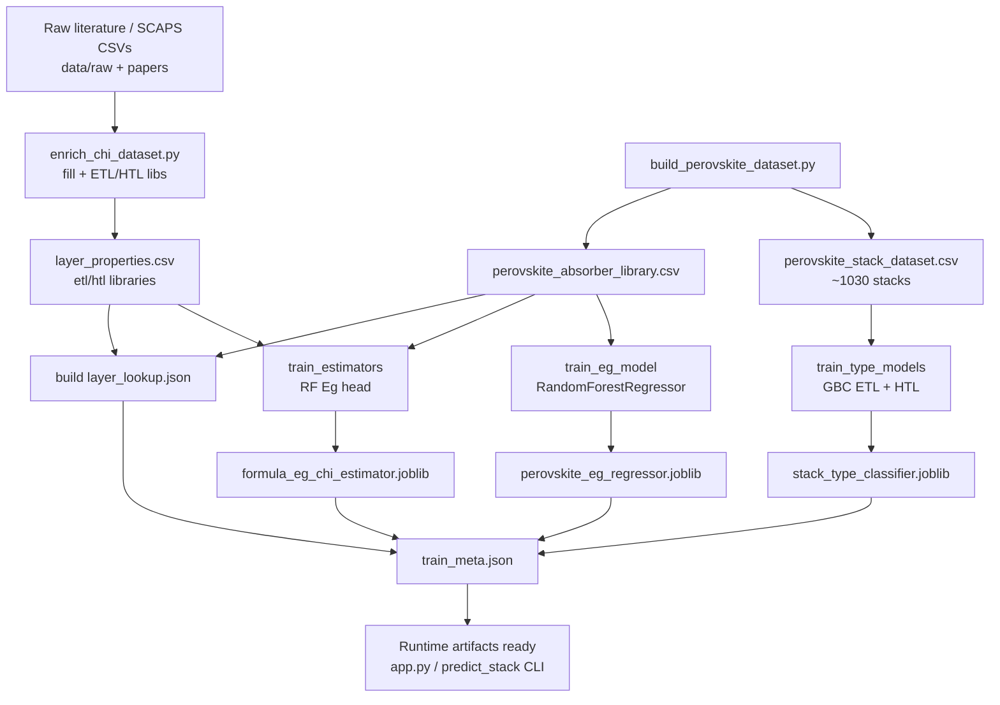

# OptoStack — Full Project Report

**Audience:** project advisor / examiner  
**Date:** 2026-08-02  
**Repo role:** perovskite stack band-alignment screening tool (pre-DFT / pre-SCAPS triage)

> **How to present this:** see [`REPORT_README.txt`](REPORT_README.txt) for file order and a 2-minute talking script. Figures live in [`report_figures/`](report_figures/) so this folder can be zipped and shared.

---

## 1. Project overview

### What OptoStack does

OptoStack screens a **perovskite absorber + ETL + HTL** triple and reports:

1. **Anderson junction Type** at each interface (absorber–ETL and absorber–HTL): **Type I** (straddling), **Type II** (staggered), or **Type III** (broken gap).
2. An **optoelectronic suitability** verdict: **YES** / **MARGINAL** / **NO**, derived from those two Types.

It is a **band-alignment screening** tool meant to **rank and reject** stacks quickly before expensive DFT or SCAPS device simulation.

### What OptoStack does **not** do

| Not in scope | Why |
|--------------|-----|
| **PCE / efficiency** | No device-physics PCE model |
| Stability, defects, mobility, yield | Not predicted |
| Non-perovskite absorbers as product inputs | **Blocked** by design (CZTS, CIGS, CdTe, GaAs, Si, contact oxides entered as “absorber”, 2D RP/DJ, …) |
| Affinity as a user-facing metric | Electron affinity (χ) may be used **internally** to place band edges for physics Type; it is **hidden** in the web UI and is **not** a reported evaluation deliverable |

### Absorber scope

- **Product screening:** perovskite / perovskite-inspired formulas only (ABX₃, A₂BB′X₆, A₂BX₆, A₃B₂X₉, oxide perovskites, alloys, …).
- **CdTe policy:** CdTe device-paper stacks are ingested for **Type-ML training only**. At inference / UI, CdTe (and other non-perovskites) remain **blocked**.

---

## 2. Models in use

Runtime prefers **literature / stack-table lookup** and **physics Type** from band edges when parameters are complete. The table below is the **ML fallback** stack used when library values are missing.

| Component | Role | sklearn class | Key hyperparameters | Artifact |
|-----------|------|---------------|---------------------|----------|
| Absorber Eg | Band-gap estimate for unknown absorbers | `RandomForestRegressor` | `n_estimators=500`, `max_depth=None`, `min_samples_leaf=1`, `random_state=42` | `data/models/perovskite_eg_regressor.joblib` |
| Formula Eg | Eg head for free-text formulas (blended with family/Vegard priors at inference) | `RandomForestRegressor` | `n_estimators=400`, `max_depth=20`, `min_samples_leaf=2`, `random_state=42` | `data/models/formula_eg_chi_estimator.joblib` |
| Junction Type — ETL | Absorber–ETL Type when physics path unavailable | `GradientBoostingClassifier` (Pipeline) | `n_estimators=100`, `learning_rate=0.1`, `max_depth=3`, `random_state=42`; features = OneHot(absorber, partner) + scaled Eg diffs / organic flags | `data/models/stack_type_classifier.joblib` |
| Junction Type — HTL | Absorber–HTL Type (same artifact, separate head) | same | same | same joblib |

**One-line summary:** OptoStack ML fallbacks = Eg RF (500) + formula Eg RF + Type ETL/HTL GBC pipelines (all `random_state=42`).

> Internal note (not a user-facing metric): completing the physics Type path can use band-edge placement that depends on Eg and affinity. Affinity is **not** shown in the UI and is **not** part of the cross-validation scorecard below.

---

## 3. Dataset summary

| Dataset | Size | Role |
|---------|-----:|------|
| `perovskite_stack_dataset.csv` | **~1030** stacks | Primary Type-training / known-stack table (SCAPS pool + expansion absorbers + CdTe training-only corners) |
| `perovskite_absorber_library.csv` | **~1764** absorbers | Eg library (Paper5 + Pilania + verified lead halides + …); Eg CV expands verified_external ×10 → ~1908 samples |
| `etl_material_library.csv` / `htl_material_library.csv` | tens of contacts | Contact Eg (+ internal band parameters) |
| `layer_properties.csv` + `models/layer_lookup.json` | unified lookup | Runtime layer resolve |
| CdTe paper rows | ~21 stacks | **Training-only**; inference still blocks CdTe as absorber |

**Stack provenance (approx.):** ~897 SCAPS perovskite absorbers × pooled contacts; ~112 expansion absorbers × curated ETL/HTL grid; ~21 CdTe training-only. Types in the stack table are **physics-derived** from band edges (`junction_type`), not hand-labeled.

Full catalog: [`DATASETS.md`](DATASETS.md).

---

## 4. Cross-validation — one whole-tool evaluation

Source: [`../data/cross_validation_report.md`](../data/cross_validation_report.md) (date 2026-08-02).

This is a **single OptoStack scorecard**: absorber Eg estimation and junction Type classification that feed suitability screening. Metrics describe **ML-fallback** performance under GroupKFold; runtime still prefers literature / stack-table lookup when available.

### Tool scorecard (preferred protocol)

| Tool component | Headline metric | mean ± std |
|----------------|-----------------|------------|
| Absorber Eg | R² | **0.9327 ± 0.0063** |
| Absorber Eg | MAE (eV) | 0.3021 ± 0.0066 |
| Formula Eg (fallback) | R² | 0.9167 ± 0.0117 |
| Formula Eg (fallback) | MAE (eV) | 0.3547 ± 0.0191 |
| Junction Type — ETL | Accuracy | 0.6697 ± 0.2462 |
| Junction Type — ETL | macro F1 | 0.6054 ± 0.2991 |
| Junction Type — ETL | macro OvR ROC-AUC | 0.8364 ± 0.1931 |
| Junction Type — HTL | Accuracy | **0.8330 ± 0.0955** |
| Junction Type — HTL | macro F1 | 0.8191 ± 0.1097 |
| Junction Type — HTL | macro OvR ROC-AUC | 0.8940 ± 0.0864 |

- Absorber Eg pooled OOF R² = **0.9331**; formula Eg pooled OOF R² = **0.9173**.
- **Protocol:** Eg → GroupKFold (k=5) by material `base_name`; Type → GroupKFold by absorber (realistic for novel absorbers). StratifiedKFold Type numbers are higher but often optimistic (name memorization) and are secondary.

### Literature Eg holdout (complementary)

On `perovskite_test_set_literature.csv` (tool vs literature Eg, n=30 scored): MAE **0.1404 eV**, R² **0.6782**; hit-rate \|error\| ≤ 0.3 eV ≈ **76.7%**. Detail: [`../data/perovskite_test_set_literature_accuracy_report.md`](../data/perovskite_test_set_literature_accuracy_report.md).

### CV figures

#### Absorber Eg — predicted vs actual (R²)



*Plain language:* each point is an out-of-fold Eg prediction. Points near the diagonal mean the Eg regressor tracks literature/library gaps well under leave-material-group CV (R² ≈ 0.93).

#### Absorber Eg — fold-wise R²



*Plain language:* all five GroupKFold splits land in a tight high-R² band — performance is stable across folds, not a lucky single split.

#### Absorber Eg — residuals



*Plain language:* residual plot for diagnosing bias vs gap size. Scatter around zero is expected; large systematic trends would flag model issues.

#### Formula Eg — predicted vs actual



*Plain language:* ML Eg head used inside the formula estimator (CV of that head only; inference still blends family/Vegard priors). Slightly lower R² than the dedicated absorber Eg model (~0.92).

#### Junction Type — ETL ROC (one-vs-rest)



*Plain language:* how well the ETL-side Type classifier ranks class probabilities under leave-absorber-out CV. Macro OvR ROC-AUC ≈ 0.84; accuracy is lower and more variable because novel absorbers are hard.

#### Junction Type — HTL ROC (one-vs-rest)



*Plain language:* HTL-side Type ranking is stronger (macro OvR ROC-AUC ≈ 0.89; accuracy ≈ 0.83) under the same GroupKFold protocol.

#### Junction Type — ETL confusion heatmap



*Plain language:* where ETL Types are confused (I ↔ II ↔ III). Off-diagonal mass shows which alignments are hardest for the ML fallback.

#### Junction Type — HTL confusion heatmap



*Plain language:* same view for the HTL interface — cleaner diagonals align with the higher HTL accuracy.

Reproduce:

```bash
python scripts/cross_validate_models.py
```

---

## 5. Functional & operational workflows

Diagrams adapted from [`TOOL_FLOWCHART.md`](TOOL_FLOWCHART.md). Operator detail: [`TOOL_WORKFLOW.md`](TOOL_WORKFLOW.md). Engineering detail: [`TECHNICAL_WORKFLOW.md`](TECHNICAL_WORKFLOW.md).

### 5.1 Operational runtime (user → display)



**Plain language:** the operator enters three materials. OptoStack normalizes names, blocks non-perovskite absorbers, then either returns a known curated stack or builds Types from library/estimated gaps (physics path) or from the Type-ML fallback. Suitability is always a **rule** on the two Types. The Flask UI never turns on optional LLM fill.

### 5.2 Offline training & data pipeline



**Plain language:** curated SCAPS/DFT tables are enriched and assembled into absorber and stack CSVs. Those tables train the Eg and Type models and build the runtime lookup. Serving only needs the CSVs + `data/models/` artifacts (no retrain on every predict if models exist).

### 5.3 Compact module map

| Stage | Module |
|-------|--------|
| UI | `app.py` |
| Orchestration | `scripts/predict_stack.py` |
| Normalize / parse | `scripts/formula_parse.py` |
| Perovskite gate / family priors | `scripts/perovskite_rules.py` |
| Formula Eg estimate | `scripts/formula_estimator.py` |
| Junction + suitability | `scripts/literature_bands.py` |
| Enrich offline | `scripts/enrich_chi_dataset.py` |
| Whole-tool CV | `scripts/cross_validate_models.py` |

---

## 6. How to interpret YES / MARGINAL / NO

Suitability is **deterministic** from the two interface Types (not a trained classifier, **not** a PCE score):

| Verdict | Rule | Practical reading |
|---------|------|-------------------|
| **YES** | Both interfaces are Type I or Type II | Band alignment looks acceptable for standard confinement/separation screening — shortlist for deeper sim |
| **MARGINAL** | Exactly **one** interface is Type III | One broken-gap contact — redesign that contact **or** verify whether Type III is intentional (e.g. some deep oxides as HTL) |
| **NO** | Both Type III (or a Type missing → UNKNOWN) | Not recommended for typical optoelectronic stacks under this screen |

| Type | Physics picture | Screening implication |
|------|-----------------|------------------------|
| **Type I** | Straddling (one gap contains the other) | Usually acceptable for confinement |
| **Type II** | Staggered offsets | Usually acceptable for separation |
| **Type III** | Broken gap | Usually **not** preferred — unless notes say broken-gap-by-design |

**Method pills worth noticing**

| Signal | Meaning |
|--------|---------|
| **physics** / **known stack** | Highest trust for triage when contacts are common and no `predicted` badges |
| **ML Type** / **`predicted` badges** | Screening-grade — verify before heavy DFT/SCAPS |
| Blocked / not perovskite | Outside tool scope |

---

## 7. Example stacks

### 7.1 MAPbI₃ / TiO₂ / MoO₃ → **MARGINAL** (Type II + Type III)

Live tool result (`predict_stack`, no LLM):

| Field | Value |
|-------|-------|
| Absorber (normalized) | CH₃NH₃PbI₃ (MAPbI₃) |
| ETL | TiO₂ |
| HTL | MoO₃ |
| Absorber–ETL Type | **Type II** |
| Absorber–HTL Type | **Type III** |
| Suitability | **MARGINAL** |
| Method | `literature_stack_row` (exact curated stack) |
| Absorber Eg | 1.55 eV |
| Note | MoO₃ flagged **broken_gap_by_design** — deep oxide; Type III can be the *intended* hole-extraction picture, not a random mismatch |

**Teaching point:** MARGINAL does **not** mean “bad PCE.” It means “one interface is Type III under Anderson rules — inspect before DFT spend.”

### 7.2 Typical YES pattern (operator checklist)

Common lead-halide + TiO₂ / Spiro-style contacts often land **Type I/II + Type I/II → YES** when library band parameters are complete. Prefer results with **physics / known stack** and **no** `predicted` badges before claiming readiness for SCAPS/DFT.

### 7.3 CLI / UI demo

```bash
python scripts/predict_stack.py --absorber MAPbI3 --etl TiO2 --htl MoO3
python app.py   # http://127.0.0.1:7860
```

---

## 8. Caveats (read before publishing numbers)

1. **Not PCE / stability / defect prediction** — band-alignment screen only.
2. **Lookup vs ML:** CV numbers describe ML fallbacks. Runtime prefers curated lookup + physics Type when complete.
3. **GroupKFold vs random Type accuracy:** Stratified/random splits can look near-perfect via material-name memorization; leave-absorber-out GroupKFold is the realistic number for novel absorbers (ETL especially harder).
4. **Suitability is not CV’d** — YES/MARGINAL/NO is a rule on Types + offsets, not a supervised model.
5. **Formula Eg CV** scores the ML Eg head; inference blends family/Vegard priors.
6. **Operator assigns ETL/HTL roles** — the tool does not enforce “ZnO must be ETL”; wrong roles → misleading Types.
7. **Estimated internal band parameters** and free-text formulas can be wrong far from the library; PEDOT:PSS-like degenerate polymer HTLs make Eg-based Anderson Type unreliable.
8. **Indirect-gap** absorbers (e.g. some double perovskites) may carry optical-absorption caveats even on YES.
9. **CdTe** appears in training stacks only; product gate still blocks it as absorber.
10. Holdout MAE in `train_meta.json` uses a single random split and may differ from GroupKFold means in this report.

---

## 9. Quick start (for the demo)

```bash
pip install -r requirements.txt
python scripts/enrich_chi_dataset.py   # once / after library changes
python scripts/predict_stack.py --train  # if models missing
python app.py
```

Optional LLM fill is **CLI-only** (`--llm`); the web UI always uses `use_llm=False`.

---

## 10. Document index

| File | Use |
|------|-----|
| [`REPORT_README.txt`](REPORT_README.txt) | Presentation order |
| This file | Self-contained advisor report |
| [`report_figures/`](report_figures/) | Embedded CV PNGs |
| [`../data/cross_validation_report.md`](../data/cross_validation_report.md) | Full CV tables |
| [`../data/perovskite_test_set_literature_accuracy_report.md`](../data/perovskite_test_set_literature_accuracy_report.md) | Literature Eg accuracy |
| [`TOOL_FLOWCHART.md`](TOOL_FLOWCHART.md) | Mermaid source |
| [`TOOL_WORKFLOW.md`](TOOL_WORKFLOW.md) | Operator workflow |
| [`TECHNICAL_WORKFLOW.md`](TECHNICAL_WORKFLOW.md) | Engineering pipeline |
| [`DATASETS.md`](DATASETS.md) | Dataset catalog |
| [`../README.md`](../README.md) | Repo entry point |
