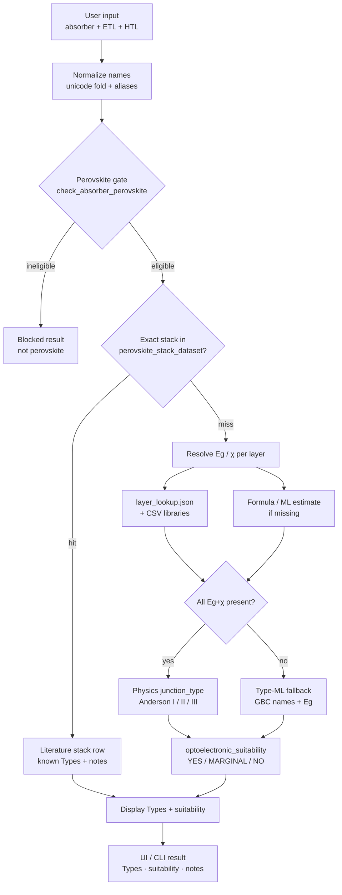
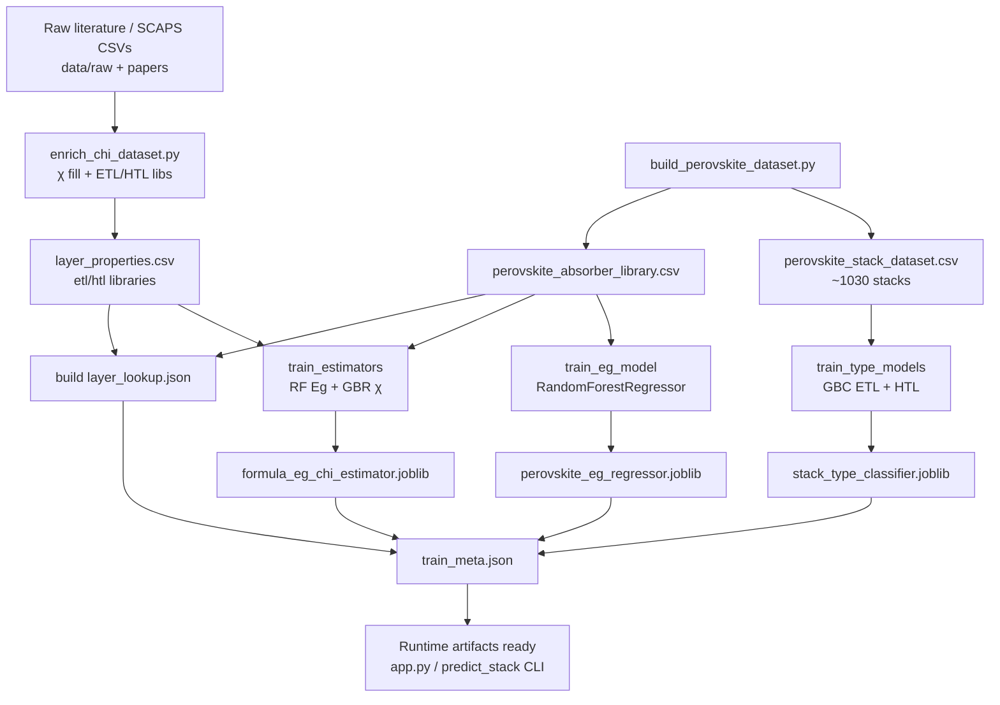

# OptoStack — functional & operational flowchart

End-to-end diagrams of **runtime prediction** and **offline training / data pipeline**.

Related: [TOOL_WORKFLOW.md](TOOL_WORKFLOW.md) (operators) · [TECHNICAL_WORKFLOW.md](TECHNICAL_WORKFLOW.md) (engineering detail) · [DATASETS.md](DATASETS.md) · [full advisor report](OPTOSTACK_FULL_REPORT.md) · [cross-validation report](../data/cross_validation_report.md)

---

## 1. Operational runtime path (user → display)

What happens when an operator submits absorber / ETL / HTL in the Flask UI or CLI.

**Notes**

- UI always calls `predict_stack(..., use_llm=False)`. Optional `--llm` is CLI-only.
- Library / lookup Eg+χ preferred over ML. Same formula → deterministic estimate when ML/rules apply.
- Suitability is a rule on the two interface Types (not a trained model).

---

## 2. Offline training & data pipeline

How curated tables and `.joblib` artifacts are produced before serving predictions.

**Production models (`random_state=42`)**

| Artifact | Class | Key hyperparameters |
|----------|-------|---------------------|
| `perovskite_eg_regressor.joblib` | `RandomForestRegressor` | n_estimators=500, max_depth=None, min_samples_leaf=1 |
| `formula_eg_chi_estimator.joblib` (Eg) | `RandomForestRegressor` | n_estimators=400, max_depth=20, min_samples_leaf=2 |
| `formula_eg_chi_estimator.joblib` (χ) | `GradientBoostingRegressor` | n_estimators=300, max_depth=4, learning_rate=0.05 |
| `stack_type_classifier.joblib` | `GradientBoostingClassifier` ×2 | defaults (n_estimators=100, max_depth=3, lr=0.1) + OneHot+Eg pipeline |

Cross-validation of OptoStack user-facing ML fallbacks (Eg + junction Type; not affinity as a CV deliverable): `python scripts/cross_validate_models.py` → [data/cross_validation_report.md](../data/cross_validation_report.md).

---

## 3. Module touchpoints (compact)

| Stage | Module |
|-------|--------|
| UI | `app.py` |
| Orchestration | `scripts/predict_stack.py` |
| Normalize / parse | `scripts/formula_parse.py` |
| Perovskite gate / family priors | `scripts/perovskite_rules.py` |
| Formula Eg/χ | `scripts/formula_estimator.py` |
| Junction + suitability | `scripts/literature_bands.py` |
| Enrich offline | `scripts/enrich_chi_dataset.py` |
