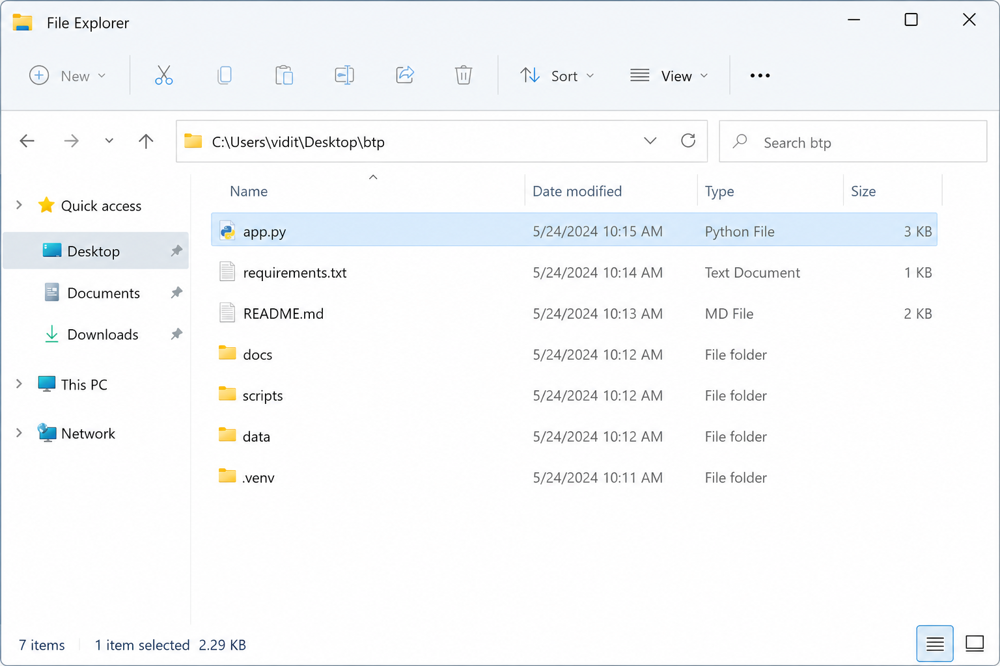
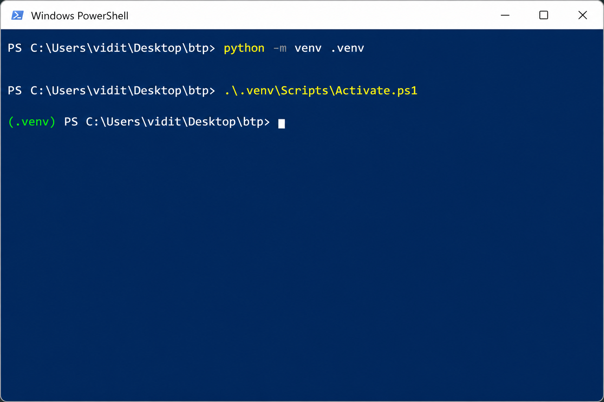
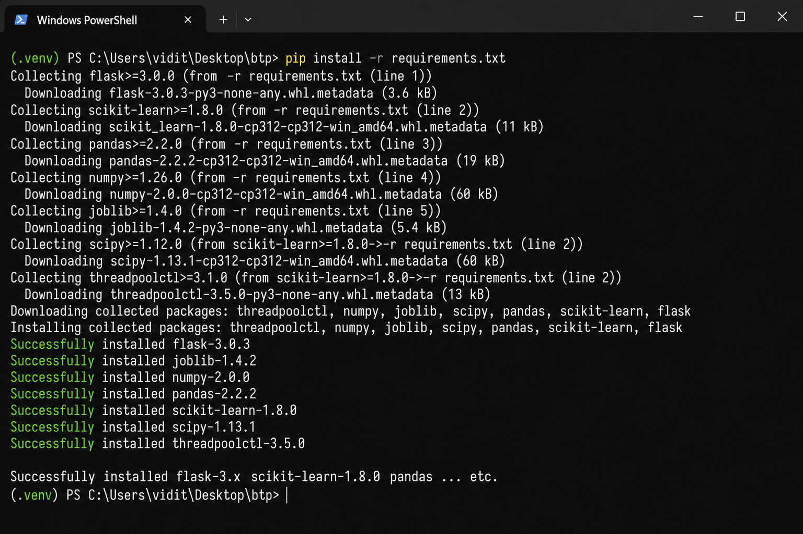
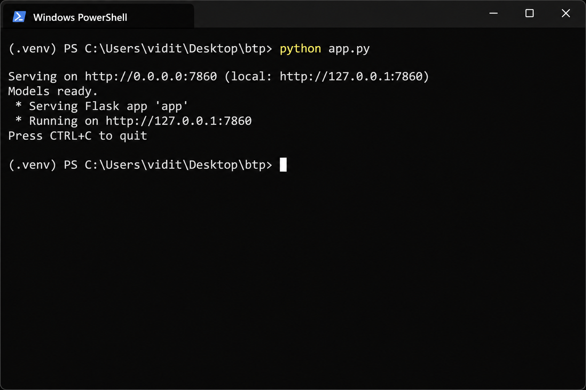
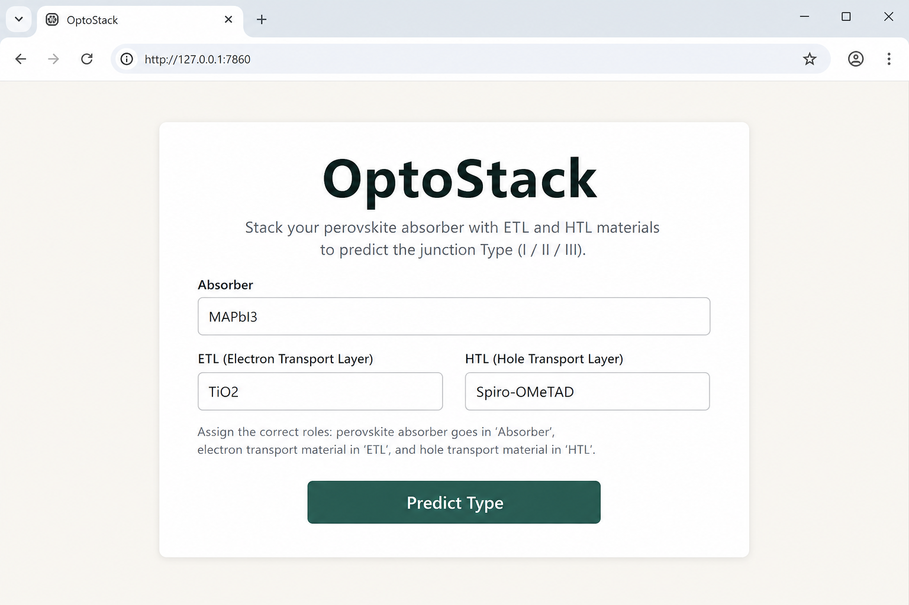
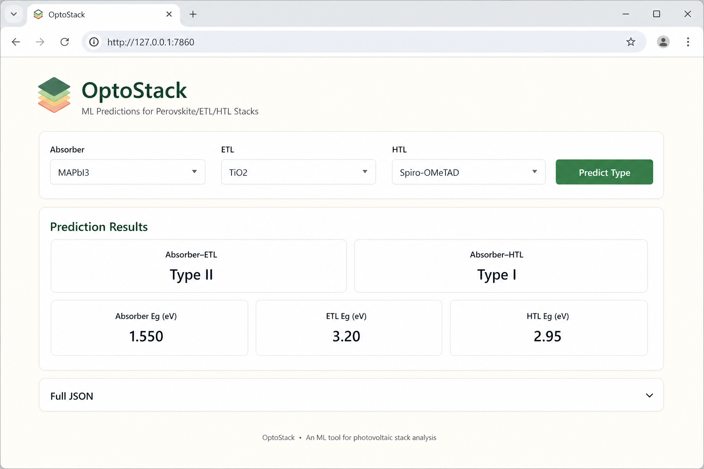
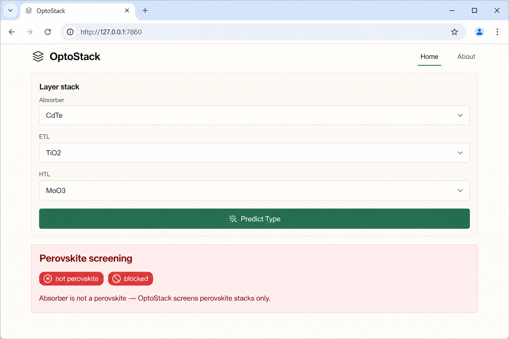

# OptoStack — Local User Manual (Methodology)

**Audience:** students and advisors who need a reproducible procedure to run the OptoStack web tool on a local Windows machine.  
**UI documented here:** current intended interface on branch `feat/remove-optoelectronic-suitability` — button **Predict Type**, outputs **Types** + **Eg**, blocking for bad absorbers/contacts. Suitability YES/MARGINAL/NO is **not** shown.  
**Related QA:** [NEGATIVE_TEST_CASES.md](NEGATIVE_TEST_CASES.md) — inputs that must fail / be blocked.

---

## Purpose

OptoStack is a **screening** tool for perovskite optoelectronic stacks. You enter an **absorber**, **ETL**, and **HTL**; the tool returns junction **Type I / II / III** at each interface and band-gap (**Eg**) values (library or estimated). It does **not** predict power conversion efficiency (PCE), stability, or claim that a stack will fabricate into a working device. Type alignment is a band-alignment triage step only.

---

## Prerequisites

| Requirement | Notes |
|-------------|--------|
| **OS** | Windows 10/11 (PowerShell) |
| **Python** | 3.10 or newer |
| **Internet** | Needed once to `pip install` dependencies |
| **Project folder** | `C:\Users\vidit\Desktop\btp` (or your clone of this repo) |

Optional LLM API keys (`.env`) are **not** required for the web UI.

---

## Step I — Install / verify Python

1. Open **PowerShell**.
2. Run:

```powershell
python --version
```

3. Confirm output is **Python 3.10** or higher (e.g. `Python 3.12.x`).

If `python` is not found, install Python from [python.org](https://www.python.org/downloads/) and ensure **“Add python.exe to PATH”** is checked.

---

## Step II — Open the project directory

In PowerShell:

```powershell
cd C:\Users\vidit\Desktop\btp
```

Confirm you see `app.py`, `requirements.txt`, `data\`, and `scripts\` in File Explorer or via `dir`.



---

## Step III — Create a virtual environment

From the project root:

```powershell
python -m venv .venv
```

This creates a local `.venv` folder so OptoStack dependencies do not mix with other Python projects.



---

## Step IV — Activate the virtual environment

```powershell
.\.venv\Scripts\Activate.ps1
```

Your prompt should show `(.venv)` at the start.

**If PowerShell blocks scripts** (execution policy error), run once for the current user:

```powershell
Set-ExecutionPolicy -Scope CurrentUser RemoteSigned
```

Then retry `Activate.ps1`. Alternatively use Command Prompt:

```cmd
.venv\Scripts\activate.bat
```

---

## Step V — Install requirements

With the venv active:

```powershell
pip install -r requirements.txt
```

Wait until packages finish installing. **Important:** `requirements.txt` pins **`scikit-learn==1.8.0`**. The committed models under `data/models/` were built for this version; a different major/minor can fail to load joblib artifacts (e.g. `No module named '_loss'`).



---

## Step VI — Start the application

Still in the project root with `(.venv)` active:

```powershell
python app.py
```

You should see a line similar to:

```text
Serving on http://0.0.0.0:7860 (local: http://127.0.0.1:7860)
```

The server binds host `0.0.0.0` on port **`PORT`** if set, otherwise **7860**. Models warm up in a background thread; pretrained files in `data/models/` usually load quickly. A `/healthz` endpoint returns `{"status":"ok","models_ready": ...}` for liveness checks.

Leave this terminal window open while you use the UI.



---

## Step VII — Open the web UI in a browser

Open:

**http://127.0.0.1:7860**

You should see the **OptoStack** form: fields for **Absorber**, **ETL**, **HTL**, and a green **Predict Type** button.



---

## Step VIII — Enter materials and predict

1. Fill in the three layers (datalist suggestions appear as you type).
2. Click **Predict Type**.

**Worked example (methodology demo):**

| Field | Example value |
|-------|----------------|
| Absorber | `MAPbI3` |
| ETL | `TiO2` |
| HTL | `Spiro-OMeTAD` |

Hints under the form remind you that:

- OptoStack does **not** check whether a material is conventionally used as ETL vs HTL — **role assignment is your responsibility**.
- Only perovskite-family absorbers are accepted; non-perovskites are rejected.
- Estimated values are tagged **predicted**.

---

## Step IX — Read the outputs

### Successful prediction

A successful run shows a results panel with:

| Field | Meaning |
|-------|---------|
| **Absorber–ETL** | Junction Type (I / II / III) at the absorber–ETL interface |
| **Absorber–HTL** | Junction Type at the absorber–HTL interface |
| **Absorber Eg (eV)** | Absorber band gap |
| **ETL Eg (eV)** / **HTL Eg (eV)** | Contact band gaps |
| **predicted** badge | Value came from estimation / ML, not a measured library entry |
| **Full JSON** | Expandable debug dump (χ / suitability internals are scrubbed from the UI JSON) |

There is **no** suitability verdict (YES / MARGINAL / NO) in this UI.



### Blocked inputs

If the stack is outside scope, a red-tinted banner appears with pills such as **blocked**, **not perovskite**, or **invalid contact**:

- **Perovskite screening** — absorber is not accepted as a perovskite (e.g. CdTe, Si, CZTS) or is otherwise gated.
- **Contact screening** — ETL/HTL string is nonsensical or rejected so the model does not invent band gaps.

Fix the inputs and submit again.



### Warm-up message

If you submit while models are still loading after a cold start, you may see: *“The server is still warming up its models… try again in a minute.”* Wait briefly and retry.

---

## Step X — Stop the server

In the PowerShell window running `python app.py`, press:

```text
Ctrl+C
```

The Flask process stops. Deactivate the venv when finished with:

```powershell
deactivate
```

---

## Optional troubleshooting

| Problem | What to try |
|---------|-------------|
| Port already in use | Stop the other process on 7860, or set another port: `$env:PORT=7861; python app.py` then open `http://127.0.0.1:7861` |
| Models / warm-up delay | First start after deleting models may retrain; wait for “Models ready” / retry Predict after ~1 minute. Artifacts live under `data/models/` |
| `No module named '_loss'` or joblib load errors | Reinstall the pinned stack: `pip install -r requirements.txt` (ensure **scikit-learn==1.8.0**). The app may delete incompatible joblibs and retrain |
| `Activate.ps1` blocked | `Set-ExecutionPolicy -Scope CurrentUser RemoteSigned` |
| Wrong folder | `cd C:\Users\vidit\Desktop\btp` before `python app.py` |
| Health check | Browse `http://127.0.0.1:7860/healthz` — expect `"status":"ok"` |

---

## Disclaimer

- Assigning a material to the **ETL** or **HTL** field is the **user’s responsibility**; OptoStack does not enforce conventional contact roles.
- **Type I / II / III** alignment and **Eg** screening are **not** a guarantee of a working optoelectronic device, high PCE, or experimental success.
- Use results for **pre-DFT / pre-device triage**; confirm promising stacks with literature values and device simulation.

---

## Quick command checklist

```powershell
cd C:\Users\vidit\Desktop\btp
python -m venv .venv
.\.venv\Scripts\Activate.ps1
pip install -r requirements.txt
python app.py
# Browser → http://127.0.0.1:7860
# Ctrl+C to stop
```
